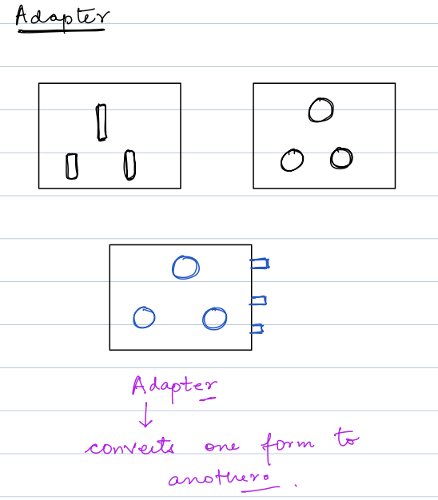

# Design Pattern

pattern: frequently occurs

A Design Pattern is a reusable solution to a commonly occurring problem in software design. It provides a template for solving issues that can be used in many different situations. Design patterns are formalized best practices that help developers create more maintainable, flexible, and scalable software.

Key aspects of design patterns:
- They are proven solutions that have evolved over time
- They provide a common vocabulary for developers
- They help in writing more organized and maintainable code
- They speed up the development process by providing tested solutions
- They prevent subtle issues that can cause major problems
## Types of Design Patterns

Design patterns are typically categorized into three main types:

1. **Creational Patterns**
    - Deal with object creation mechanisms
    - Examples: Singleton, Factory Method, Abstract Factory, Builder, Prototype

2. **Structural Patterns**
    - Focus on object composition and relationships
    - Examples: Adapter, Bridge, Composite, Decorator, Facade, Proxy

3. **Behavioral Patterns**
    - Concerned with communication between objects
    - Examples: Observer, Strategy, Command, State, Template Method

Each type solves different kinds of problems and provides specific ways to organize code relationships.

## Singleton Pattern

The Singleton pattern ensures a class has only one instance and provides a global point of access to it.

### Key Characteristics
- Private constructor
- Static instance
- Global access point

### Common Use Cases
- Database connections
- Configuration settings
- Logger instances
- Thread pools

### Example Implementation (Java)
```java
public class Singleton {
    private static Singleton instance;
    
    private Singleton() {}
    
    public static Singleton getInstance() {
        if (instance == null) {
            instance = new Singleton();
        }
        return instance;
    }
}
```

### Advantages
- Controls access to shared resources
- Ensures single instance
- Lazy initialization possible

### Disadvantages
- Can make unit testing difficult
- Can be considered an anti-pattern
- Global state can be problematic

## Role of the Singleton Pattern in Spring Boot

In Spring Boot, the default scope for beans is **singleton**. This means that the Spring container creates a single instance of each bean, which is then shared across the entire application context. This is analogous to the Singleton design pattern, where only one instance of a class is allowed.

**Key Points:**
- **Resource Efficiency:** A single instance is created and reused, reducing overhead.
- **Consistency:** Ensures that every component that depends on a bean gets the same instance, which is particularly useful for stateless services.
- **Performance:** Beans are initialized only once, which can lead to faster startup times and reduced memory usage.
- **Dependency Injection:** Spring manages bean creation and injection, so you can rely on the singleton behavior without implementing manual checks.

While singletons are ideal for many components (like service and repository layers), Spring also supports other scopes (such as prototype, request, and session) for cases where a single instance is not appropriate.

## Factory Method Pattern

The Factory Method pattern is a creational design pattern that provides an interface for creating objects but lets subclasses decide which class to instantiate. It promotes loose coupling by allowing object creation without exposing the creation logic.

### Key Characteristics
- Defines an interface for creating objects
- Lets subclasses alter the type of objects created
- Moves object creation to subclasses
- Promotes loose coupling

### Real-World Analogy
Think of a restaurant's kitchen. The kitchen (factory) creates different types of dishes (products) based on customer orders, but the dining area (client) doesn't need to know how each dish is prepared.

### Example Implementation (Java)
```java
// Product interface
interface Animal {
    void makeSound();
}

// Concrete products
class Dog implements Animal {
    @Override
    public void makeSound() {
        System.out.println("Woof!");
    }
}

class Cat implements Animal {
    @Override
    public void makeSound() {
        System.out.println("Meow!");
    }
}

// Creator interface
abstract class AnimalFactory {
    abstract Animal createAnimal();
    
    // Common operations using the factory method
    public void playWithAnimal() {
        Animal animal = createAnimal();
        animal.makeSound();
    }
}

// Concrete creators
class DogFactory extends AnimalFactory {
    @Override
    Animal createAnimal() {
        return new Dog();
    }
}

class CatFactory extends AnimalFactory {
    @Override
    Animal createAnimal() {
        return new Cat();
    }
}

// Client code
public class Main {
    public static void main(String[] args) {
        AnimalFactory dogFactory = new DogFactory();
        dogFactory.playWithAnimal(); // Output: Woof!
        
        AnimalFactory catFactory = new CatFactory();
        catFactory.playWithAnimal(); // Output: Meow!
    }
}
```

### Common Use Cases
- Framework development
- Plugin architectures
- Customizable object creation
- Cross-platform compatibility

### Advantages
- Decouples object creation
- Single Responsibility Principle
- Open/Closed Principle
- Flexible and extensible code

### Disadvantages
- Can increase complexity
- Requires creating many new subclasses
- May be overkill for simple object creation

## Builder Pattern

The Builder pattern is a creational design pattern that lets you construct complex objects step by step. It's particularly useful when you need to create an object with numerous possible configurations.

### Key Characteristics
- Separates object construction from its representation
- Provides clear separation of the construction and representation
- Allows fine control over the construction process
- Supports construction of complex objects

### When to Use
- Complex object creation with many optional parameters
- When object creation requires multiple steps
- When the algorithm for creating an object should be independent of the parts

### Example Implementation (Java)
```java
public class Computer {
    private String CPU;
    private String RAM;
    private String storage;
    
    private Computer(Builder builder) {
        this.CPU = builder.CPU;
        this.RAM = builder.RAM;
        this.storage = builder.storage;
    }
    
    public static class Builder {
        private String CPU;
        private String RAM;
        private String storage;
        
        public Builder setCPU(String cpu) {
            this.CPU = cpu;
            return this;
        }
        
        public Builder setRAM(String ram) {
            this.RAM = ram;
            return this;
        }
        
        public Builder setStorage(String storage) {
            this.storage = storage;
            return this;
        }
        
        public Computer build() {
            return new Computer(this);
        }
    }
}

// Usage
Computer computer = new Computer.Builder()
    .setCPU("Intel i7")
    .setRAM("16GB")
    .setStorage("512GB SSD")
    .build();
```

### Advantages
- Encapsulates complex construction
- Allows variable object representation
- Provides better control over construction process
- More readable with many parameters

### Disadvantages
- Requires separate builder for each type
- Code can become more verbose
- Increases overall complexity
## Adapter Pattern

The Adapter pattern is a structural design pattern that allows incompatible interfaces to work together. It acts as a bridge between two incompatible interfaces by wrapping an object in an adapter to make it compatible with another class.

### Key Characteristics
- Converts interface of one class into another interface clients expect
- Enables classes to work together that otherwise couldn't
- Acts as a wrapper between two incompatible interfaces

### Real-World Analogy
Think of a power adapter that allows you to use a device with a different plug type - it adapts one type of plug to work with another type of socket.


### Example Implementation (Java)
```java
// Target interface (what the client expects)
interface USPlug {
    void powerWithUSSocket();
}

// Adaptee (the class that needs to be adapted)
class EUPlug {
    void powerWithEUSocket() {
        System.out.println("Using EU socket for power");
    }
}

// Adapter
class PlugAdapter implements USPlug {
    private EUPlug euPlug;

    public PlugAdapter(EUPlug euPlug) {
        this.euPlug = euPlug;
    }

    @Override
    public void powerWithUSSocket() {
        euPlug.powerWithEUSocket();
        System.out.println("Adapted to work with US socket");
    }
}

// Client code
public class Main {
    public static void main(String[] args) {
        EUPlug euPlug = new EUPlug();
        USPlug adapter = new PlugAdapter(euPlug);
        adapter.powerWithUSSocket();
    }
}
```

### Common Use Cases
- Legacy system integration
- Third-party library integration
- Converting data formats
- API compatibility layers

### Advantages
- Increases reusability of existing code
- Provides flexibility in using incompatible classes
- Follows single responsibility principle
- Improves maintainability

### Disadvantages
- Increases complexity of the code
- Sometimes many adapters needed for complete integration
- May require updates if interfaces change