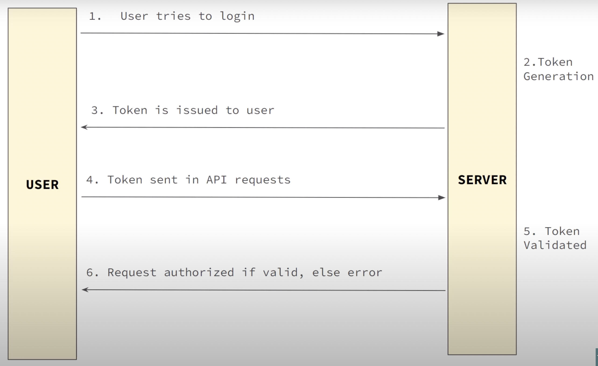

# JWT Authentication
jwt: json web token

session tokens:
if a client resister first time with user name and password. website send a token, it will store in cookies. this tokens are allow to access website and their features. 

jwt autherize the user. it is open industry standard.     

