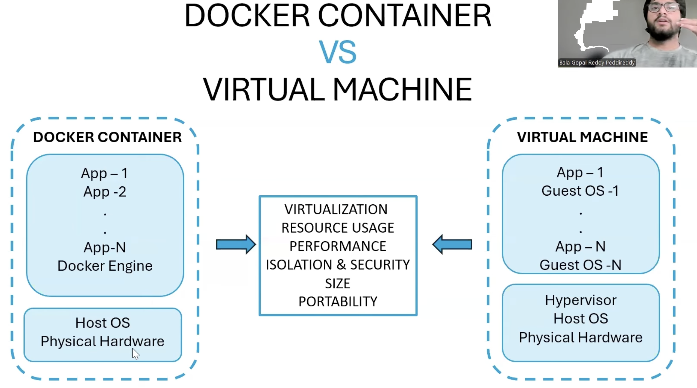
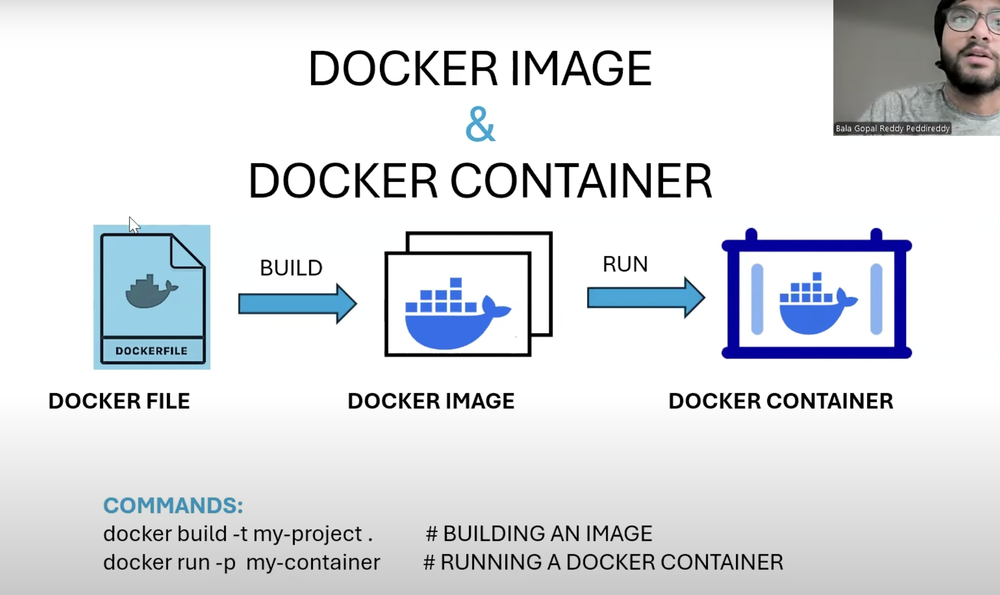
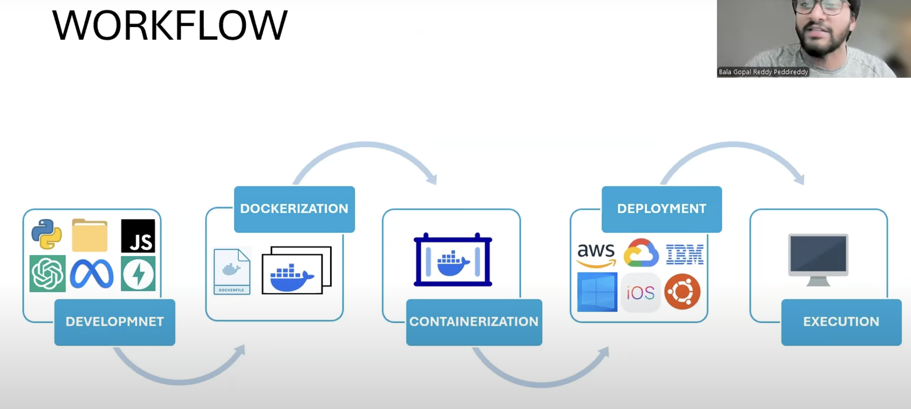
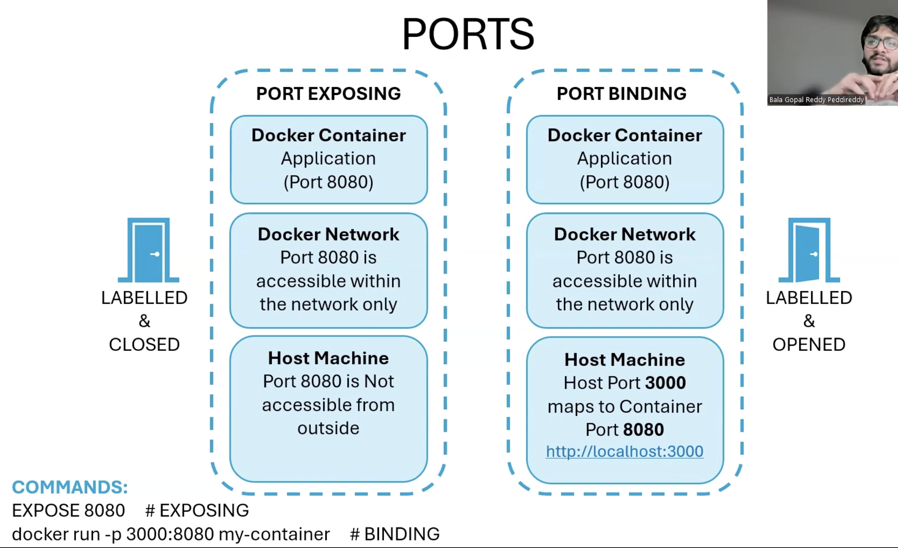

# Docker

## Feartures of Docker
1. Containerization 

## Containerization 

## Version Control 
make the trash of all updated images on dokcer hub

## Portability 
Container can run any system irrespective system type, just they need docker engine on that system. 

## Efficiency 
Docker share the os karnal which make it lightwieght and faster to run. 

## Scalability 
Allows us to run multiple containers 

## Docker Hub

## Docker Workflow

The typical workflow of Docker involves several key steps:

1. **Write a Dockerfile**  
    Define the environment and instructions to build your application image.

2. **Build the Image**  
    Use the Dockerfile to build a container image using `docker build`.

3. **Store the Image**  
    Push the built image to a registry like Docker Hub.

4. **Pull the Image**  
    Download the image from the registry to any system.

5. **Run the Container**  
    Start a container from the image using `docker run`.

### Docker Workflow Block Diagram

